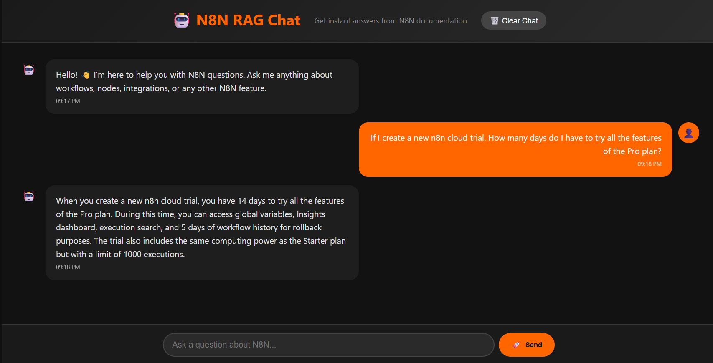

# 👋 Hey, I'm Mohammed Rayid  
### ⚡ AI Engineer & Automation Enthusiast | Building Intelligent Workflows & Creative Systems

---

### 🧠 About Me  
I'm passionate about creating **AI-powered automations, intelligent chat systems, and context-aware assistants** that make technology feel alive.  
From local LLM setups to web-integrated RAG systems — I love designing tools that merge **creativity, engineering, and automation** into seamless experiences.

> I experiment, build, break, and rebuild until it *just works perfectly.*

---

## 🚀 Highlighted Project — N8N RAG Chat  

**Retrieval-Augmented Generation (RAG)** system for exploring and querying the entire **N8N documentation** through a beautiful chat interface powered by **local AI**.

### 🌟 Features
- **Dark Mode Interface** with orange accents  
- **Real-time Chat** with memory  
- **Markdown Rendering** for rich responses  
- **Responsive Design** for all devices  
- **Local AI Integration** via **LM Studio**  
- **Vector Search** using **ChromaDB** + **Sentence Transformers**

---

## 💼 JoblyFit  

An **AI-driven job matching platform** that analyzes resumes and job postings to recommend best-fit opportunities and optimize candidate profiles.  
Built with a **focus on precision**, **readability**, and **intuitive UI**, JoblyFit helps users align their professional strengths with the right career paths.

---

## 🧩 N8N MCP Copilot  

AI-powered copilot for **N8N workflows**, built using **Claude** and the **Model Context Protocol (MCP)**.  
It brings a conversational layer to N8N, allowing you to:  
- Browse, analyze, and understand workflows  
- Chat naturally about automation logic  
- Extend or modify workflows intelligently  
- Serve as a framework for **context-aware automation assistance**

---

## 🎙️ SynthMind  

A beautiful, interactive **AI voice assistant web application** with a stunning animated sphere interface.  
This project combines **AI-powered responses**, **speech synthesis**, and **engaging motion design** to create a truly immersive conversational experience.

---

## ⚙️ N8N Automations Showcase  

### 🧵 Twitter Trends Posting Bot  
Fetches trending news via the **Reddit API**, filters the top 5, and lets an **AI agent** (powered by a local LLM through LM Studio) turn them into short, hashtag-optimized tweets — then automatically posts them on Twitter.  

### 🐱 AI Cat Content Generator 
An **AI agent** generates a fun creative prompt (random cat breed + activity + setting), sends it to a **Hugging Face image generation API**, and emails the generated image + caption daily — just for a smile.  

### 📚 WhatsApp Study Buddy  
An **AI-powered study assistant** built with **N8N** and integrated with **OpenAI or local LLMs**.  
It listens for incoming WhatsApp messages, passes them to an AI agent with a friendly *Study Buddy* prompt, and replies instantly with clear explanations, real-world examples, and helpful analogies — turning your chats into interactive tutoring sessions available anytime.

---

## 🧰 Tech Stack  

**AI & ML:**  
`Python` • `Sentence Transformers` • `ChromaDB` • `LangChain` • `LM Studio` • `Claude AI` • `Hugging Face`

**Web & Backend:**  
`Flask` • `Node.js` • `Express` • `React` • `JavaScript` • `HTML` • `CSS`

**Automation & Systems:**  
`N8N` • `APIs` • `Git` • `Linux` • `AWS` • `DNS & Web Hosting`

---

## 🌐 Connect with Me  
  
  

---

> “Automation is art, and AI is the brush — I build where both meet.” 🎨🤖
